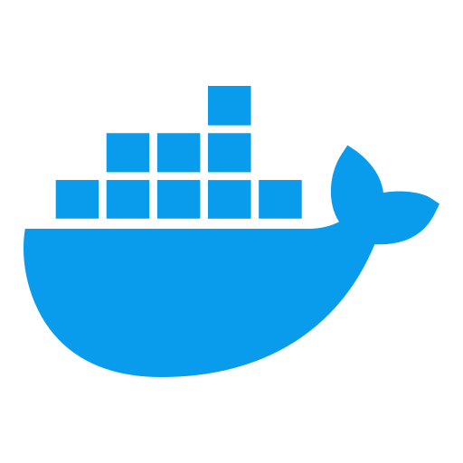

  

  I'm <strong>Ronak Parmar</strong> - I build random stuff passionately.

## Now building

<table>
<tr>

<td valign="top" width="33%">

### FableCut

> Zero-dependency browser video editor that AI agents can drive — JSON timeline, MCP + REST, live-reloading UI. Edit by conversation instead of by scrubbing.

[Site](https://fablecut.space) · [GitHub](https://github.com/ronak-create/FableCut) · [WebMCP entry](https://github.com/ronak-create/fablecut-webmcp)

</td>

<td valign="top" width="33%">

### Burrow

> Voice-driven AI research assistant on an infinite canvas. Local-first, bring your own key. Dig until you hit the root of it.

[Live](https://burrow.ronakparmar.space/) · [GitHub](https://github.com/ronak-create/burrow)

</td>

<td valign="top" width="33%">

### DeepSeek-V4 in C

> DeepSeek-V4 in C99, streamed off NVMe. Runs the 284B Flash checkpoint from 3.2 GB of RAM — 1.81 s/token with a GPU, verified against PyTorch to 2.9e-6.

[GitHub](https://github.com/ronak-create/deepseek-v4-in-c)

</td>

</tr>
</table>

## Selected work

| Project | What it is |
|---|---|
| **[Lynx](https://github.com/ronak-create/Lynx)** | Multi-agent business research — type a company and 15 agents fan out into a live dashboard, knowledge graph and documentary — [live](https://lynx.ronakparmar.space) |
| **[Foundation CLI](https://github.com/ronak-create/Foundation-Cli)** | Dependency-aware full-stack project assembler — pick your stack, get a working app in under 3 minutes — [npm](https://www.npmjs.com/package/@systemlabs/foundation-cli) |
| **[aero](https://github.com/ronak-create/aero)** | Zero-dependency terminal coding agent |
| **[LapDeck](https://github.com/ronak-create/LapDeck)** | Turn your phone into a remote deck for your Windows laptop — launcher, touchpad, keyboard, live screen, media & power. One Node process, zero cloud |
| **[TerraFirm](https://github.com/ronak-create/TerraFirm)** | Interactive 3D globe that becomes a live street map as you zoom — over free, keyless OpenStreetMap data |
| **[Dragoon](https://github.com/ronak-create/Dragoon-The-Js-Compiler)** | A JavaScript compiler written in C, targeting QBE |

 

<table>
  <tr>
    <td align="center" width="100" height="40">
       C
    </td>
    <td align="center" width="100" height="40">
       Python
    </td>
    <td align="center" width="100" height="40">
       JavaScript
    </td>
    <td align="center" width="100" height="40">
       TypeScript
    </td>
    <td align="center" width="100" height="40">
       React
    </td>
    <td align="center" width="100" height="40">
       Node.js
    </td>
    <td align="center" width="100" height="40">
       FastAPI
    </td>
    <td align="center" width="100" height="40">
       Flask
    </td>
  </tr>
  <tr>
    <td align="center" width="100" height="40">
       TensorFlow
    </td>
    <td align="center" width="100" height="40">
       OpenCV
    </td>
    <td align="center" width="100" height="40">
       MongoDB
    </td>
    <td align="center" width="100" height="40">
       PostgreSQL
    </td>
    <td align="center" width="100" height="40">
       Redis
    </td>
    <td align="center" width="100" height="40">
       Docker
    </td>
    <td align="center" width="100" height="40">
       GActions
    </td>
    <td align="center" width="100" height="40">
       Linux
    </td>
  </tr>
</table>

 

  
  &nbsp;
  
  &nbsp;
  
  &nbsp;
  

